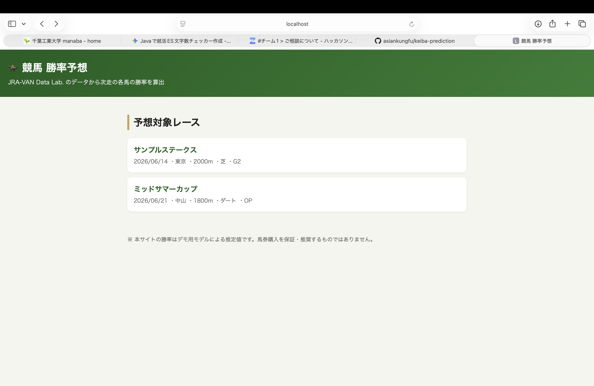
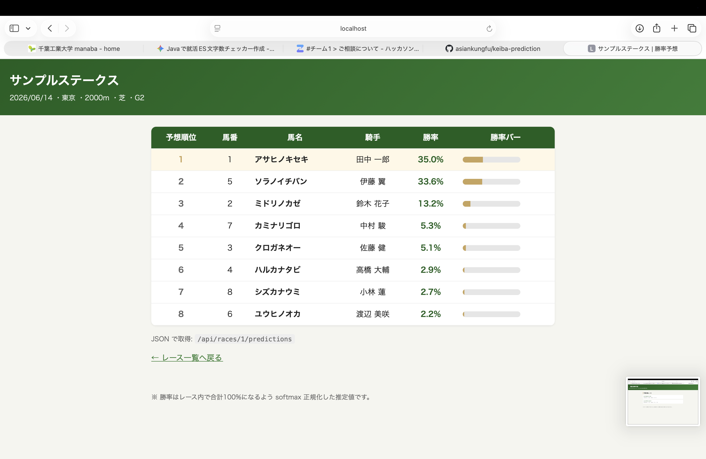

# 🏇 競馬 勝率予想Webアプリ（keiba-prediction）


JRA-VAN Data Lab.（JRA公式データサービス）のレースデータから、**次に行われるレースの各出走馬の勝率**を算出して表示するWebアプリです。
就職活動のポートフォリオとして、業務系で重視される **レイヤード設計・関心の分離・テスト容易性** を意識して実装しました。

> **データ取得元について**
> 競馬情報サイトのスクレイピングは各サイトの利用規約で禁止されているため採用していません。
> JRA公式の有料データサービス **JRA-VAN Data Lab.** を一次データ源とし、取得経路を抽象化することで、
> 契約・Windows環境が無くても**同梱のサンプルデータで完全に動作**します。

## デモ画面

| レース一覧 (`/`) | 勝率予想 (`/races/{id}`) |
|---|---|
|  |  |

> スクショは初回起動後に撮影して `docs/images/` に置き換えてください。

## 主な特徴（アピールポイント）

- **取得元を差し替え可能な設計** — `RaceDataSource` インターフェースで「どこからデータを取るか」を抽象化。
  本番は JRA-VAN（`JvLinkRaceDataSource`）、デモ/CIは同梱CSV（`CsvRaceDataSource`）を**設定一つで切替**（依存性逆転の原則）。
- **テストしやすい勝率ロジック** — 算出処理をフレームワーク非依存の純粋クラス `WinProbabilityCalculator` に分離。JUnitで単体テスト済み。
- **学習と的中率評価まで実施** — 履歴データから重みを学習し、バックテストで的中率を定量評価。
  **テストデータでTop-1的中率 38.0%（ベースライン33.3%・ランダム8.8%）、Top-3的中率 72.0%**（詳細は [docs/evaluation.md](docs/evaluation.md)）。
- **セットアップ不要で即起動** — 組込みDB(H2)＋同梱CSVで `mvn spring-boot:run` だけで動作。本番はプロファイル切替でPostgreSQL。
- **説明可能な勝率モデル** — 特徴量の線形和を softmax 正規化（多クラスロジスティック回帰相当）。勝率はレース内で必ず合計100%。

## 出馬表を手入力して予想（実レース対応）

トップの「＋ 新規レースを登録」から、**出馬表を画面で手入力**して勝率を予想できます
（スクレイピングに依存せず、公式の出馬表などを見ながら自分で入力する方式）。

1. `/races/new` でレース（名称・日付・競馬場・距離・馬場・グレード）を作成
2. `/races/{id}/edit` で出走馬を1頭ずつ追加（馬番・馬名・騎手・斤量・通算成績・騎手勝率・条件適性）
3. `/races/{id}` で各馬の勝率を表示

通算勝率は「通算勝利 ÷ 通算出走」で自動計算。実在のレース（例: 宝塚記念）の出馬表を入力すれば、
その場で予想に使えます。

## 技術スタック

Java 17 / Spring Boot 3.3（Web・Data JPA・Thymeleaf）/ H2・PostgreSQL / Maven / JUnit 5・AssertJ

## アーキテクチャ

```
web        … Controller（HTTP・画面）
service    … PredictionService（ユースケース）/ WinProbabilityCalculator（純粋ロジック）
domain     … Race / RaceEntry / Horse（エンティティ）
repository … Spring Data JPA
ingest     … RaceDataSource（IF）→ CsvRaceDataSource / JvLinkRaceDataSource
```

詳細は [docs/design.md](docs/design.md)（設計書）を参照。

## 勝率の算出方法

```
score_i = w0 + w1·通算勝率 + w2·騎手勝率 + w3·条件適性 − w4·(斤量 − 基準斤量)
p_i     = exp(score_i) / Σ_j exp(score_j)     ← レース内 softmax 正規化
```

重み `w0..w4` は `application.yml`（`keiba.model.*`）で調整可能。実運用では過去データで学習した値に差し替える想定です。

## Docker / デプロイ / CI

**Dockerで起動（H2・単体）:**
```bash
docker build -t keiba-prediction .
docker run -p 8080:8080 keiba-prediction   # http://localhost:8080/
```

**Docker Composeで起動（PostgreSQL・本番想定）:**
```bash
docker compose up --build
```

**クラウドへ公開（Render の例）:**
1. このリポジトリをGitHubにpush（済み）。
2. Render で「New + → Blueprint」からリポジトリを選ぶと `render.yaml` を読んで自動構築。
3. 数分で `https://keiba-prediction.onrender.com` のような公開URLが発行される。
   （無料プランは一定時間アクセスが無いとスリープし、初回アクセスが遅い点に注意）

**CI（GitHub Actions）:** `main` への push / PR で `mvn verify`（ビルド＋テスト）が自動実行されます（`.github/workflows/ci.yml`）。READMEのバッジで結果が見えます。

## 動かし方

前提: JDK 17 以上、Maven 3.9 以上

```bash
# デモ実行（H2 + 同梱CSV、セットアップ不要）
mvn spring-boot:run

# ブラウザで開く
#   http://localhost:8080/                    レース一覧
#   http://localhost:8080/races/1             勝率予想
#   http://localhost:8080/api/races/1/predictions   JSON API
#   http://localhost:8080/h2-console          DB中身の確認
```

### テスト

```bash
mvn test
```

### 重みの学習・的中率評価（オフライン）

「オフラインで学習 → アプリは推論のみ」という実務的な構成。Pythonのみ（依存ライブラリ不要）。

```bash
python3 scripts/generate_history.py      # 結果ラベル付き履歴データ生成（再現可能）
python3 scripts/train_and_evaluate.py    # 学習＋Top-1/Top-3的中率・log lossを表示
```

学習済み重みは `application.yml` の `keiba.model.*` に反映済み。結果は [docs/evaluation.md](docs/evaluation.md)。

### 本番想定（PostgreSQL）

```bash
export DB_URL=jdbc:postgresql://localhost:5432/keiba
export DB_USER=keiba
export DB_PASSWORD=keiba
mvn spring-boot:run -Dspring-boot.run.profiles=prod
```

### JRA-VAN（実データ）連携

`keiba.datasource=jvlink` で `JvLinkRaceDataSource` が有効になります。
実データ取得には **Windows環境・JRA-VAN Data Lab. の契約・JACOB（Java-COM Bridge）** が必要です。
取り込みフロー・レコード種別・マッピング・バッチ運用・実データで宝塚記念に使うまでの手順は
[docs/jravan-integration.md](docs/jravan-integration.md) にまとめています。

## ディレクトリ構成

```
keiba-prediction/
├── pom.xml
├── docs/
│   ├── design.md                ← 設計書
│   └── evaluation.md            ← 的中率評価レポート
├── scripts/                     ← 学習・評価（オフライン, Python）
│   ├── generate_history.py
│   └── train_and_evaluate.py
└── src/
    ├── main/java/com/example/keiba/
    │   ├── domain/              ← エンティティ
    │   ├── repository/          ← 永続化
    │   ├── service/             ← 勝率ロジック・ユースケース
    │   ├── ingest/              ← データ取得（IF＋CSV/JV-Link実装）
    │   ├── web/                 ← Controller
    │   └── config/              ← DI・設定
    ├── main/resources/
    │   ├── application.yml
    │   ├── sample-data/races.csv
    │   ├── templates/           ← Thymeleaf
    │   └── static/css/
    └── test/java/...            ← 単体テスト
```

## 免責

本アプリの勝率は統計的推定値であり、的中や利益を保証するものではありません。馬券の購入は自己責任で行ってください。
