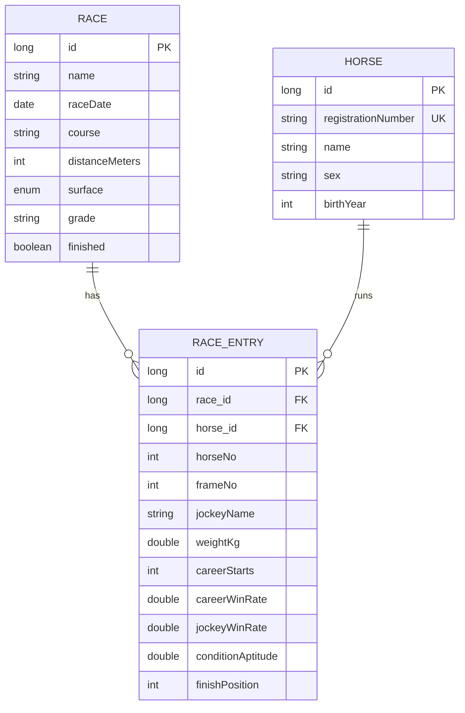

# 設計書 — 競馬 勝率予想Webアプリ

## 1. 目的・概要

JRA-VAN Data Lab.（JRAの公式データ提供サービス）から取得したレースデータをもとに、
次に行われるレースの各出走馬の勝率を算出して表示するWebアプリケーション。

就職活動のポートフォリオとして、業務系（SIer）で重視される
**レイヤードアーキテクチャ・関心の分離・テスト容易性・保守性** を意識した構成にしている。

> **データ取得元についての方針**
> netkeiba 等のサイトのスクレイピングは各サイトの利用規約で禁止されているため採用しない。
> 本アプリは JRA 公式の有料データサービス **JRA-VAN Data Lab.** を一次データ源とし、
> 取得経路を抽象化することで、契約・Windows環境が無くてもデモできる構成にしている。

## 2. 機能要件

| ID | 機能 | 概要 |
|----|------|------|
| F-01 | レース一覧表示 | 予想対象（結果未確定）のレースを一覧表示する |
| F-02 | 勝率予想表示 | レースを選ぶと各馬の勝率を高い順に表示する |
| F-03 | 予想API | 勝率を JSON で返す REST API を提供する |
| F-04 | データ取り込み | JRA-VAN または CSV からレースデータを取り込む |

## 3. 非機能要件 / 設計方針

- **取得元の差し替え可能性**: データ取得を `RaceDataSource` インターフェースで抽象化し、
  本番（JRA-VAN）とデモ（CSV）を設定で切り替える（依存性逆転の原則）。
- **テスト容易性**: 勝率算出ロジックをフレームワーク非依存の純粋クラスに切り出し、単体テスト可能にする。
- **即起動**: デモ時は組込みDB（H2）＋同梱CSVで、外部セットアップ無しに `mvn spring-boot:run` だけで動く。
- **本番想定**: プロファイル切替で PostgreSQL に接続できる。

## 4. 技術スタック

| 分類 | 採用技術 |
|------|----------|
| 言語 | Java 17 |
| フレームワーク | Spring Boot 3.3（Web / Data JPA / Thymeleaf / Validation） |
| DB | H2（デモ）／ PostgreSQL（本番想定） |
| ビルド | Maven |
| データ源 | JRA-VAN Data Lab.（JV-Link, COM）／ CSV |
| テスト | JUnit 5 / AssertJ |

## 5. アーキテクチャ

レイヤードアーキテクチャを採用。依存方向は上から下への一方向のみ。

```
[web]        RaceViewController / PredictionApiController   … 入出力（HTTP・画面）
   │
[service]    PredictionService                              … ユースケース調整
   │         WinProbabilityCalculator（純粋ロジック）        … 勝率算出（フレームワーク非依存）
   │
[domain]     Race / RaceEntry / Horse                       … エンティティ
   │
[repository] RaceRepository / HorseRepository               … 永続化（Spring Data JPA）
   ┊
[ingest]     RaceDataSource（IF）                            … 取得元の抽象
             ├ CsvRaceDataSource（デモ/CI）
             └ JvLinkRaceDataSource（本番: JRA-VAN）
```

ポイントは、`ingest` を **インターフェースで抽象化**して `service` から具体実装を切り離していること。
これにより「JRA-VAN が無い環境でもアプリが完全に動く」ことと「将来データ源を増やせる」ことを両立する。

## 6. データモデル（ER）



## 7. 勝率算出ロジック

各馬の特徴量の線形和でスコアを出し、**レース内で softmax 正規化**する。
これは多クラスロジスティック回帰に相当し、出力はレース内で合計1.0になるため
「そのレースで勝つ確率」として解釈できる。

```
score_i = w0
        + w1 × 通算勝率_i
        + w2 × 騎手勝率_i
        + w3 × 条件適性_i        （距離・馬場への適性 0〜1）
        − w4 × (斤量_i − 基準斤量)

p_i = exp(score_i) / Σ_j exp(score_j)
```

- 数値安定化のため softmax は最大スコアを引いてから `exp` する。
- 重み `w0..w4` は `application.yml`（`keiba.model.*`）で外出し。
  既定値は履歴データから学習した値を設定済み（学習・評価手順は次節および
  [evaluation.md](evaluation.md) を参照）。

### 算出例（同梱サンプル「サンプルステークス」8頭・学習済み重み）

| 馬番 | 通算勝率 | 騎手勝率 | 条件適性 | 斤量 | 勝率 |
|----:|------:|------:|------:|----:|----:|
| 1 | 0.33 | 0.21 | 0.80 | 57.0 | **35.0%** |
| 5 | 0.40 | 0.12 | 0.70 | 55.0 | 33.6% |
| 2 | 0.25 | 0.15 | 0.65 | 55.0 | 13.2% |
| 7 | 0.17 | 0.22 | 0.60 | 58.0 | 5.3% |
| 3 | 0.20 | 0.18 | 0.55 | 57.0 | 5.1% |
| 4 | 0.13 | 0.10 | 0.50 | 56.0 | 2.9% |
| 8 | 0.17 | 0.09 | 0.40 | 54.0 | 2.7% |
| 6 | 0.10 | 0.08 | 0.45 | 55.0 | 2.2% |

合計 = 100.0%（softmax 正規化により常に合計1.0）。

### 学習と的中率評価（オフラインパイプライン）

重みは「オフラインで学習 → アプリは推論のみ」という実務的な構成で求める。
`scripts/` 配下に再現可能なパイプラインを用意している。

1. `scripts/generate_history.py` … 結果ラベル付きの履歴レース（合成）を生成。
2. `scripts/train_and_evaluate.py` … 条件付きロジットを勾配降下で学習し、
   レース単位の train/test 分割で **Top-1 / Top-3 的中率・log loss** を算出。

評価結果（テストデータ）の要点:

| 指標 | 学習モデル | ベースライン(通算勝率のみ) | ランダム |
|------|------:|------:|------:|
| Top-1 的中率 | **38.0%** | 33.3% | 8.8% |
| Top-3 的中率 | **72.0%** | — | — |

学習モデルは素朴なベースラインを上回り、ランダムの約4.3倍の的中率。詳細は [evaluation.md](evaluation.md)。

## 8. JRA-VAN（JV-Link）連携メモ

- JV-Link は **Windows用 ActiveX(COM)** コンポーネント。利用には **JRA-VAN Data Lab. の会員契約**が必要。
- Java からは **JACOB（Java-COM Bridge）** 等を介して呼び出す（Linux/Mac では動作しない）。
- 取得の標準フロー（JV-Data 仕様書準拠）:
  `JVInit` → `JVOpen`（蓄積系）/`JVRTOpen`（速報系）→ `JVRead`（レコードを逐次パース）→ `JVClose`
- 本アプリでは `JvLinkRaceDataSource` をその差し込み口（ポート）として用意し、`keiba.datasource=jvlink` で有効化する。

## 9. 画面

- `/` … 予想対象レース一覧
- `/races/{id}` … 各馬の勝率（順位・勝率バー付きテーブル）
- `/api/races/{id}/predictions` … 勝率を JSON で返す

## 10. 今後の拡張

- 重みを過去データから学習（ロジスティック回帰 / 勾配ブースティング）し、的中率を評価（対数損失・的中率）。
- 馬場状態・展開・血統など特徴量の追加。
- 取り込みのバッチ化・差分更新。

## 11. 免責

本アプリの勝率は統計的推定値であり、的中や利益を保証するものではない。馬券の購入は自己責任で。
